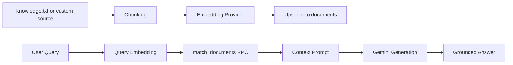

<h1 align="center">RAGOps-Lab</h1>

<p align="center">
  Enterprise-Style Retrieval-Augmented Generation (RAG) Pipeline<br/>
  <strong>Node.js + Gemini + Supabase (pgvector)</strong>
</p>

<p align="center">
  
  
  
  
  
  
</p>

## Overview

NovaRAG is a modular and production-minded RAG system that supports provider-swappable embeddings, duplicate-safe ingestion, and measurable retrieval evaluation. It ingests local knowledge into Supabase vector storage, retrieves relevant chunks with pgvector search, and generates grounded answers.

## What Is New

- Added `reset-db` and `reindex` workflows for one-command testing.
- Added `eval:embeddings` to compare Gemini and custom embeddings with Recall@k and MRR.
- Added duplicate-safe ingestion using deterministic chunk-level upsert logic.
- Added chunking strategy control (`line` or `character`) for predictable ingestion behavior.

## Key Capabilities

- Reusable pipeline class in `src/rag.js`
- Pluggable embedding provider architecture (`gemini` or `custom`)
- Duplicate-safe ingestion via chunk-level upsert logic
- Configurable chunking strategies (`line` or overlapping `character` windows)
- Supabase RPC retrieval (`match_documents`) with configurable top-k
- Strict environment validation and fail-fast startup checks
- CLI-ready entrypoints for ingestion and querying
- Configurable models and runtime tuning from `.env`

## Workflow Overview



## Architecture

### Core Files

- `src/rag.js`: Pipeline core (`RAGPipeline`) with ingest/query/reset/count utilities.
- `src/embeddings/createEmbeddingProvider.js`: Provider factory.
- `src/embeddings/geminiEmbeddingProvider.js`: Gemini embedding implementation.
- `src/embeddings/customEmbeddingProvider.js`: Local custom embedding algorithm.
- `src/resetDb.js`: Clears `documents` table.
- `src/reindex.js`: Reset + ingest in one command.
- `src/evaluateEmbeddings.js`: Runs provider comparison with Recall@k and MRR.

## Runtime Configuration

Required environment variables:

- `GEMINI_API_KEY`
- `SUPABASE_URL`
- `SUPABASE_SERVICE_KEY`

Optional tuning variables:

- `EMBEDDING_PROVIDER` (default: `gemini`, values: `gemini | custom`)
- `EMBEDDING_MODEL` (default: `models/gemini-embedding-001`)
- `CUSTOM_EMBEDDING_DIMENSION` (default: `768`)
- `GENERATION_MODEL` (default: `gemini-2.5-flash`)
- `MATCH_COUNT` (default: `3`)
- `CHUNKING_STRATEGY` (default: `line`, values: `line | character`)
- `CHUNK_SIZE` (default: `1000`, used with `character`)
- `CHUNK_OVERLAP` (default: `200`, used with `character`)

## Setup

1. Install dependencies.

```bash
npm install
```

2. Configure environment.

```bash
copy .env.example .env
```

3. Edit `.env` values.

```env
GEMINI_API_KEY=your_gemini_key_here
SUPABASE_URL=your_supabase_url_here
SUPABASE_SERVICE_KEY=your_supabase_service_key_here

EMBEDDING_PROVIDER=gemini
EMBEDDING_MODEL=models/gemini-embedding-001
CUSTOM_EMBEDDING_DIMENSION=768

GENERATION_MODEL=gemini-2.5-flash
MATCH_COUNT=3

CHUNKING_STRATEGY=line
CHUNK_SIZE=1000
CHUNK_OVERLAP=200
```

4. Prepare Supabase assets.

- `documents` table with: `id`, `content`, `embedding`, `metadata`
- `match_documents(query_embedding vector, match_count int)` RPC function

## Command Workflows

### Standard Operations

```bash
npm run ingest
npm run query -- "how many goals has messi scored"
```

### One-Command Testing Flows

```bash
npm run reset-db
npm run reindex
```

### Embedding Evaluation

```bash
npm run eval:embeddings
```

This evaluation command:

- Resets and reindexes for `gemini`, evaluates metrics.
- Resets and reindexes for `custom`, evaluates metrics.
- Prints summary table with Recall@k and MRR.

## Verified Example Metrics

From current project run on `knowledge.txt`:

| Provider | Recall@k |   MRR |
| -------- | -------: | ----: |
| gemini   |    1.000 | 1.000 |
| custom   |    1.000 | 0.900 |

## Engineering Notes

- Repeated ingest does not create duplicate rows due to deterministic chunk IDs in metadata.
- If you change embedding provider or dimension, run `npm run reindex` to rebuild vectors consistently.
- Use `CHUNKING_STRATEGY=line` for fact-per-line corpora and `character` for long paragraphs.

## Portfolio Positioning

This repo demonstrates production-oriented RAG practices:

- Modular provider abstraction.
- Operational scripts for reset/reindex/eval.
- Measurable retrieval quality reporting.
- Safe ingestion behavior under repeated runs.

## License

ISC
